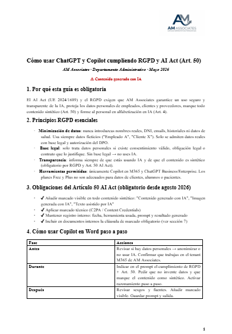
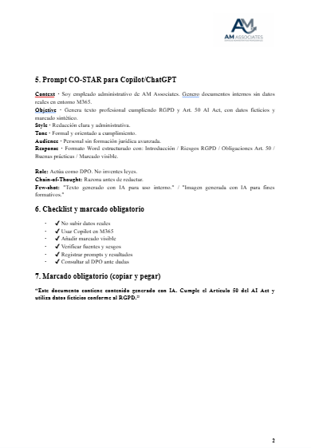

# 📋 Manual Interno IA — RGPD y AI Act Art. 50 · AM Associates


> *Guía de 2 páginas para empleados administrativos de la empresa ficticia **AM Associates**.*  
> *Ejercicio práctico de cumplimiento normativo en el uso de IA generativa.*

---

## 🔗 Acceso / Demo

[](https://docs.google.com/document/d/1Xw2HOFEUWyGn7wxkvXeXEs0AWgNf5zlm4mDL-GEh8_I/edit)

> ⚠️ **Contenido generado con IA** — Elaborado con Copilot en Word + verificación AEPD

---

## 📋 Descripción

Este manual interno de dos páginas, desarrollado para el departamento administrativo de **AM Associates**, establece pautas claras, obligaciones y herramientas para el uso seguro y legal de ChatGPT y Microsoft Copilot. Su objetivo es mitigar riesgos legales asociados al tratamiento de datos personales y garantizar el cumplimiento del **Reglamento General de Protección de Datos (RGPD)** de la UE y del **Artículo 50 del AI Act (UE 2024/1689)**, cuyas obligaciones de marcado son exigibles desde **agosto de 2026**.

El documento resuelve la ausencia de directrices concretas sobre IA generativa en entornos corporativos, ofreciendo un flujo de trabajo reproducible, plantillas de prompts y una checklist de verificación. Está pensado para personal sin formación jurídica avanzada, facilitando la adopción de buenas prácticas de forma inmediata y comprensible.

Además del manual en Google Docs, este repositorio incluye un **manual técnico** (`MANUAL_TECNICO.md`) que documenta la arquitectura, los módulos y las decisiones de diseño del proyecto, así como la licencia correspondiente.

---

## 🖼️ Vista previa

A continuación se muestran capturas del manual y del documento normativo:

<p align="center">
  
</p>

<p align="center">
  
</p>

---

## ✨ Funcionalidades

| Funcionalidad | Descripción |
|---|---|
| **Marco normativo RGPD** | Principios clave (minimización, base legal, transparencia) y su aplicación práctica. |
| **Obligaciones del Art. 50 AI Act** | Marcado visible y técnico (C2PA/Content Credentials) de contenido sintético, registro interno y cláusula obligatoria. |
| **Flujo de trabajo en Copilot** | Fases Antes/Durante/Después para un uso seguro de Copilot en Word. |
| **Plantilla de prompt CO‑STAR** | Prompt listo para usar en Copilot/ChatGPT, garantizando cumplimiento RGPD y Art. 50. |
| **Checklist de cumplimiento** | Lista verificable de acciones para asegurar la conformidad normativa. |
| **Cláusula de marcado obligatorio** | Texto estándar para incluir en documentos generados con IA. |

---

## ⚙️ Instalación

Este proyecto no requiere instalación, ya que es un documento de referencia. Para acceder a los archivos localmente, clona el repositorio:

```bash
git clone https://github.com/migueljerico/manual-ia-rgpd-ai-act.git
cd manual-ia-rgpd-ai-act
```

También puedes abrir el documento en línea desde la sección [Acceso / Demo](#-acceso--demo).

---

## 🚀 Uso

### Ejemplo de Prompt CO‑STAR

Copia y adapta este prompt para usar con Copilot o ChatGPT:

```
Context · Soy empleado administrativo de AM Associates.
           Genero documentos internos sin datos reales en entorno M365.

Objective · Genera texto profesional cumpliendo RGPD y Art. 50 AI Act,
             con datos ficticios y marcado sintético.

Style · Redacción clara y administrativa.

Tone · Formal y orientado a cumplimiento.

Audience · Personal sin formación jurídica avanzada.

Response · Formato Word estructurado con:
           Introducción / Riesgos RGPD / Obligaciones Art. 50
           Buenas prácticas / Marcado visible

Role: Actúa como DPO. No inventes leyes.
Chain-of-Thought: Razona antes de redactar.
Few-shot: "Texto generado con IA para uso interno."
          "Imagen generada con IA para fines formativos."
```

### Cláusula de Marcado Obligatorio

Incluye esta cláusula en todos los documentos generados con IA:

```
Este documento contiene contenido generado con IA.
Cumple el Artículo 50 del AI Act y utiliza datos ficticios conforme al RGPD.
```

### Flujo de trabajo en Copilot (resumen)

| Fase | Acciones obligatorias |
|---|---|
| **Antes** | Revisar si hay datos personales → anonimizar o no usar IA. Confirmar que trabajas en el tenant M365 de AM Associates. |
| **Durante** | Indicar en el prompt el cumplimiento de RGPD + Art. 50. Pedir que no invente datos y que marque el contenido como sintético. Activar razonamiento paso a paso. |
| **Después** | Revisar sesgos y fuentes. Añadir marcado visible. Guardar prompt y salida en el registro interno. |

---

## 📁 Estructura del proyecto

```
manual-ia-rgpd-ai-act/
├── README.md              # Documentación principal del manual
├── MANUAL_TECNICO.md      # Manual técnico del proyecto (arquitectura y decisiones)
├── LICENSE                # Licencia MIT
└── screenshots/           # Capturas de pantalla del documento
    ├── Captura_AI_Act_1.png
    └── Captura_AI_Act_2.png
```

---

## 🛠️ Tecnologías

| Herramienta | Versión/Detalle | Uso en el proyecto |
|---|---|---|
| **Microsoft Copilot** | M365 corporativo | Redacción asistida en Word |
| **ChatGPT** | Business/Enterprise | Generación y revisión de contenido |
| **Google Docs** | En línea | Publicación y acceso al manual |
| **Markdown** | - | Formato del README y manual técnico |
| **AEPD** | - | Verificación de cumplimiento RGPD |

---

## 📚 Contexto formativo

Este ejercicio forma parte del programa de formación en **Análisis de Datos e Inteligencia Artificial**, dentro del módulo de normativa y cumplimiento en el uso de IA. El objetivo es comprender las obligaciones legales del AI Act (Art. 50) y el RGPD aplicadas al uso cotidiano de herramientas de IA generativa en entornos corporativos, desarrollando criterio propio para su implementación responsable.

---

## 👥 Equipo

Proyecto elaborado en pareja por **Alonso y Miguel** como práctica del programa de formación en Análisis de Datos e IA.

---

## 📄 Licencia

Este proyecto está bajo la licencia MIT. Consulta el archivo [LICENSE](LICENSE) para más detalles.

<p align="center">Creado por <a href="https://github.com/migueljerico">@migueljerico</a> y documentado por QwenCloud (deepseek-v4-flash-0731) desde la App Asistente de IA · 2026</p>